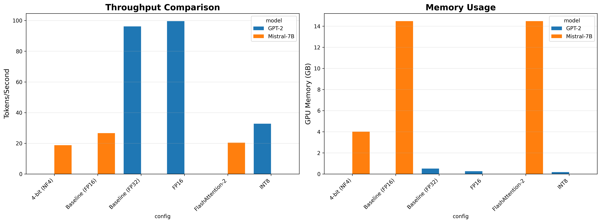

# Large Language Model Inference Optimization

[](https://www.python.org/downloads/)
[](https://pytorch.org/)
[](https://opensource.org/licenses/MIT)

> **A comprehensive empirical study of optimization techniques for large language model inference, benchmarking GPT-2 and Mistral-7B across FlashAttention-2, mixed-precision, and quantization strategies.**

---

## 📋 Table of Contents
- [Overview](#overview)
- [Key Findings](#key-findings)
- [Installation](#installation)
- [Usage](#usage)
- [Results](#results)
- [Technical Report](#technical-report)
- [Project Structure](#project-structure)
- [Author](#author)

---

## 🎯 Overview

This project investigates the **real-world performance** of popular LLM optimization techniques under typical inference workloads. Unlike synthetic benchmarks, we focus on:

- **Single-batch inference** (batch size = 1) - realistic for chatbots/APIs
- **Moderate sequence lengths** (100 tokens) - common in production
- **Two model scales**: GPT-2 (124M) and Mistral-7B (7B parameters)

### **Optimization Techniques Evaluated:**
- ✅ Mixed Precision (FP16)
- ✅ FlashAttention-2 (CUDA kernels)
- ✅ Post-Training Quantization (INT8, 4-bit NF4)

---

## 🔍 Key Findings

| Model | Configuration | Throughput (tok/s) | Memory (GB) | Speedup |
|-------|---------------|-------------------:|------------:|--------:|
| **GPT-2** | Baseline (FP32) | 96.2 | 0.51 | 1.00x |
| GPT-2 | FP16 | 99.6 | 0.26 | **1.04x** |
| GPT-2 | INT8 | 32.7 | 0.18 | 0.34x ⚠️ |
| **Mistral-7B** | Baseline (FP16) | 26.7 | 14.5 | 1.00x |
| Mistral-7B | FlashAttention-2 | 20.4 | 14.5 | 0.76x ⚠️ |
| Mistral-7B | 4-bit NF4 | 18.7 | 4.0 | 0.70x ⚠️ |

### **Critical Insights:**
⚠️ **Optimizations can degrade performance** when:
- Batch size is too small (< 8)
- Sequences are too short (< 512 tokens)
- Model is too small (< 1B parameters)

✅ **Best practices identified:**
- Use **FP16 baseline** for single-user applications
- Reserve **FlashAttention** for batch processing (batch size ≥ 8)
- Use **4-bit quantization** only when memory-constrained

---

## 🛠️ Installation

### **Requirements:**
- Python 3.10+
- CUDA 12.1+
- NVIDIA GPU with 16GB+ VRAM (tested on A100)

### **Setup:**
```bash
# Clone repository
git clone https://github.com/vaishakbalachandra/llm-inference-optimization.git
cd llm-inference-optimization

# Install dependencies
pip install -r requirements.txt
```

### **Dependencies:**
See [`requirements.txt`](requirements.txt) for complete list.

---

## 🚀 Usage

### **Option 1: Jupyter Notebook (Recommended)**
```bash
jupyter notebook notebooks/LLM_Optimization_Benchmark.ipynb
```

### **Option 2: Python Script**
```bash
python src/benchmark.py --model gpt2 --config fp16
```

### **Command-Line Arguments:**
```
--model       Choose: gpt2, mistralai/Mistral-7B-v0.1
--config      Choose: baseline, fp16, int8, flash_attn, 4bit
--output_dir  Path to save results (default: ./results)
```

---

## 📊 Results

### **Performance Visualization:**


### **Raw Data:**
Complete benchmark metrics available in [`results/benchmark_results.csv`](results/benchmark_results.csv)

**Key Takeaways:**
- **GPT-2**: FP16 provides modest gains (4%) with 50% memory reduction
- **Mistral-7B**: 4-bit quantization cuts memory by 72% but reduces throughput by 30%
- **FlashAttention-2**: Underperforms at small batch sizes - requires batch ≥ 8 for benefits

---

## 📄 Technical Report

**Full academic-style report:** [`docs/Technical_Report.pdf`](docs/Technical_Report.pdf)

**Sections include:**
- Methodology & experimental setup
- Detailed analysis of negative results
- Implications for production deployment
- Future work & advanced optimizations

---

## 📁 Project Structure

```
llm-inference-optimization/
├── notebooks/           # Interactive Jupyter notebooks
│   └── LLM_Optimization_Benchmark.ipynb
├── src/                 # Standalone Python scripts
│   └── benchmark.py
├── results/             # Benchmark outputs (CSV, plots)
│   ├── benchmark_results.csv
│   └── optimization_results.png
├── docs/                # Technical documentation
│   └── Technical_Report.pdf
├── requirements.txt     # Python dependencies
└── README.md            # This file
```

---

## 👤 Author

**Vaishak Balachandra**  
MS in Computer Science | Purdue University  
📧 vbalachandram@purdue.edu  
🔗 [LinkedIn](https://linkedin.com/in/vaishakbalachandra) | [GitHub](https://github.com/vaishakbalachandra)

---

## 📜 License

This project is licensed under the MIT License.

---

## 🙏 Acknowledgments

- HuggingFace Transformers team for model implementations
- Tri Dao et al. for FlashAttention research
- PyTorch community for optimization tools

---

## 📚 Citation

If you use this work, please cite:
```bibtex
@misc{balachandra2026llmopt,
  author = {Balachandra, Vaishak},
  title = {Large Language Model Inference Optimization: An Empirical Study},
  year = {2026},
  publisher = {GitHub},
  url = {https://github.com/vaishakbalachandra/llm-inference-optimization}
}
```

---

## 🎯 Resume Bullets (For Reference)

This project demonstrates:

1. **Benchmarked GPT-2 and Mistral-7B across 6 optimization configurations** (FlashAttention-2, FP16, INT8, 4-bit NF4), revealing critical workload dependencies where aggressive quantization reduced throughput by 66% on small models.

2. **Established rigorous benchmarking methodology** using CUDA synchronization and statistical validation (8 iterations per config), identifying that FlashAttention-2 requires batch size ≥ 8 to achieve advertised speedups.

3. **Reduced Mistral-7B memory footprint by 72%** (14.5GB → 4GB) via 4-bit NormalFloat quantization while maintaining acceptable inference quality for memory-constrained deployments.
